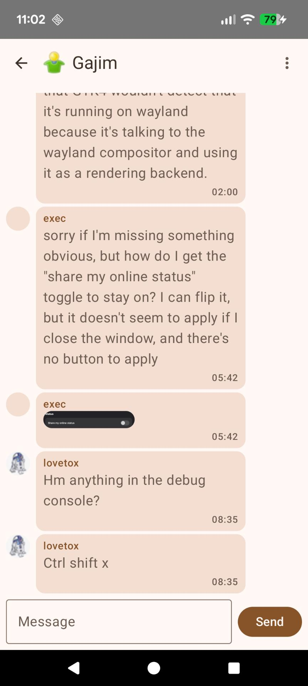
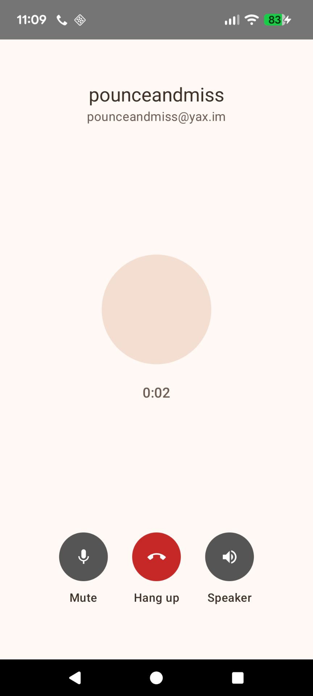

# tacky_android

A PoC Android wrapper around the Tacky XMPP daemon (`tackyd-json`). The app launches
the daemon as a foreground-service subprocess and talks to it over stdin/stdout in
JSON.

## Screenshots

  
  

## The daemon binary

The daemon isn't built here. Build it, then copy the result in:

    make android   # in the tacky tree
    cp tacky/dist/jniLibs/arm64-v8a/*.so app/src/main/jniLibs/arm64-v8a/

That's the default jniLibs location, and it's gitignored, so the binary never gets
committed. Re-copy it whenever the daemon changes.

`libtackyd_json.so` is actually an executable, not a library. The `lib*.so` name is
what gets it installed into the app's native lib dir, where the service can exec it.
`useLegacyPackaging` keeps it unpacked on disk, and `keepDebugSymbols` skips the
strip pass so there's no NDK to deal with.

## Building

    ./build-apk.sh                       # debug APK in app/build/outputs/apk/debug/
    ./build-apk.sh :app:assembleRelease  # args pass through to gradle

This runs in a pinned Docker image (JDK 17, Android SDK 34, Gradle 8.7), so you
don't need anything Android installed on the host. After editing the Dockerfile,
rebuild the image with `REBUILD=1`.

You can also open the project in Android Studio, or run gradle yourself if you have
the SDK: `gradle wrapper` once, then `./gradlew assembleDebug`.

